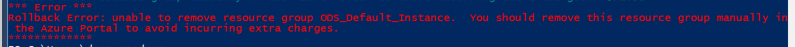

# Troubleshooting and Tuning an Azure Cloud ODS installation

## Troubleshooting

### Execution policy error

If you have never run PowerShell scripts from your system before, you may need
to adjust your PowerShell execution policy. The Cloud ODS PowerShell scripts are
not signed, so you'll need to set your script execution policy to
"Unrestricted". The below command will adjust your local execution policy for
your current PowerShell session only.

```powershell
Set-ExecutionPolicy -Scope Process -ExecutionPolicy Unrestricted
```

### Script fails with an Azure error

Like any cloud provider, Azure services may experience intermittent problems.
These problems can manifest themselves as errors during your deployment. The
install scripts are designed with these errors in mind. If you do happen to
experience an error during setup, it's recommended you simply run the
installation process again. Note that you may need to perform some cleanup of
resources in the Azure portal if the setup script errored in such a way that it
could not automatically perform cleanup for you.

In such cases you may see an error such as this:



*Due to the design of Azure's internal cleanup processes, if an installation
does fail, it's strongly recommended that you wait at least 15 minutes after
deleting the failed installation to try your deployment again. Alternatively,
you can run the deployment script with a different -InstallFriendlyName
argument.*

## Tuning

Note that by default the ODS is deployed in Azure at service levels estimates to
support service operations of a mid-sized school district. There are two options
for further tuning.

### Scale Down Script

For ODS deployment for evaluation purposes, the Cloud ODS install files include
a script called ScaleDown-EdFiODS.ps1 that will set the deployment to minimal
levels. This will significantly degrade performance, but is suitable for
situations where an ODS installation needs to be available only intermittently
for evaluation. Important: do not do this scale down before all steps in the
setup process is complete.

Use the -InstallFriendlyName parameter to identify the Cloud ODS to scale down.
A typical command will look like this:

```powershell
.\ScaleDown-EdFiOds.ps1 -InstallFriendlyName "[Your ODS Name]"
```

### Manual Tuning
Those resources can be manually tuned in the Azure Control Panel to increase or
lower service levels. This is a good way to reduce costs if you are evaluating
or only using the services in some minimal capacity. Note that scaling resources
in Azure is an online operation, so you can scale your resources while the Cloud
ODS remains online and accessible.

In the Azure control panel:

1. Locate the Resource Group created for your Cloud ODS installation. It will be
   named similarly to the -InstallFriendlyName argument you passed to the setup
   script, or "EdFi_ODS" if you did not provide a friendly name.
2. Opening the Resource Group will show all the resources that compose your
   Cloud ODS.
3. For databases, locate resources of type "Sql Database". For each database,
   click "Pricing Tier (scale DTUs)" and select the level required.
4. For web apps, locate resources of type "App Service Plan". For each service
   plan, click "Scale up (App Service plan)" and select the level required.

The ODS will continue to function at minimal service levels, but it is
recommended to complete setup or update processes before setting to the lowest
levels.

_Back to the [User's Guide Table of Contents](user-guide-toc.md)_
