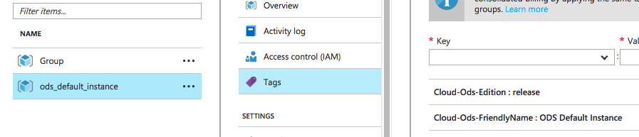

# Updating the Cloud ODS on Azure

The Cloud ODS and API project includes a set of scripts to aid in updating an
existing copy of the Ed-Fi ODS and API originally deployed to Microsoft's Azure
platform via the provided deployment scripts. The goal of this effort is to
reduce the amount of time and effort needed to update an existing ODS with a new
release.

## Target Audience

This document is targeted at IT professionals with some experience in software
deployments. A minimal amount of experience with command prompts is necessary.
Some familiarity with Microsoft PowerShell is ideal.

## Prerequisites

The following are prerequisites to run a successful ODS deployment using the ODS
ARM templates:

1. Account at Microsoft Azure
2. Access to a Windows machine with Powershell installed (Windows 7 or later)
3. Azure Powershell Module
4. Copy of the Deployment Templates
5. A copy of the ODS previously deployed via the process described here

## Versioning

At present there is no automated process for performing major version updates of
the Cloud ODS. Your installation's Admin App may alert you to an available
update, but the update script will refuse to install a major version update.

By way of example, if you have a Cloud ODS/ API version 1.1.0 installed and
Ed-Fi has published version 2.0.0, the update script will not allow you to
install the new update. In this instance, Ed-Fi may provide instruction on how
to manually update.

On the other hand, if you have version 1.1.3 installed and Ed-Fi has published
version 1.2.0, the update script will perform the update for you automatically.

If you want to install a specific update version, you can specify this version
to the update script using the -Version parameter

## Running the Update

1. Start a new Powershell session.

2. Navigate to the directory where you've saved your templates and scripts. This
   will be a filesystem directory, such as C:\Temp\CloudODS.

```powershell
cd C:\Temp\CloudODS
```

3. Identify the friendly name of the ODS instance you want to update. This is
   the name you provided at install time via the -InstallFriendlyName parameter.
   If you don't recall this name, you can find it within the Azure portal by
   finding the Azure Resource Group which contains your installation. Then,
   examine the "Tags" attached to the resource group to find the
   "Cloud-Ods-FriendlyName". In the below example, the friendly name is "ODS
   Default Instance".



4. Run the Update-EdFiOds.ps1 script. If necessary, you can also provide a
   specific version number via the -Version parameter (omitting this parameter
   will install the latest version).

A typical update will look like this:

```powershell
.\Update-EdFiOds.ps1 -InstallFriendlyName "MyODS"
```

## Next Steps

After the update script has been completed, log back in to the Admin App for
your Cloud ODS. You'll be prompted to run a quick post-upgrade setup step, after
which your Cloud ODS will be updated and usable once again.

_Back to the [User's Guide Table of Contents](user-guide-toc.md)_
