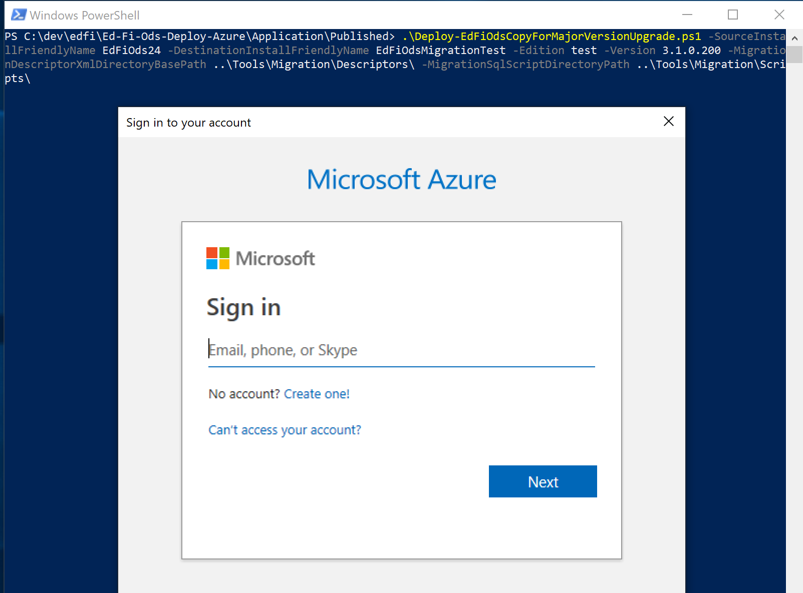
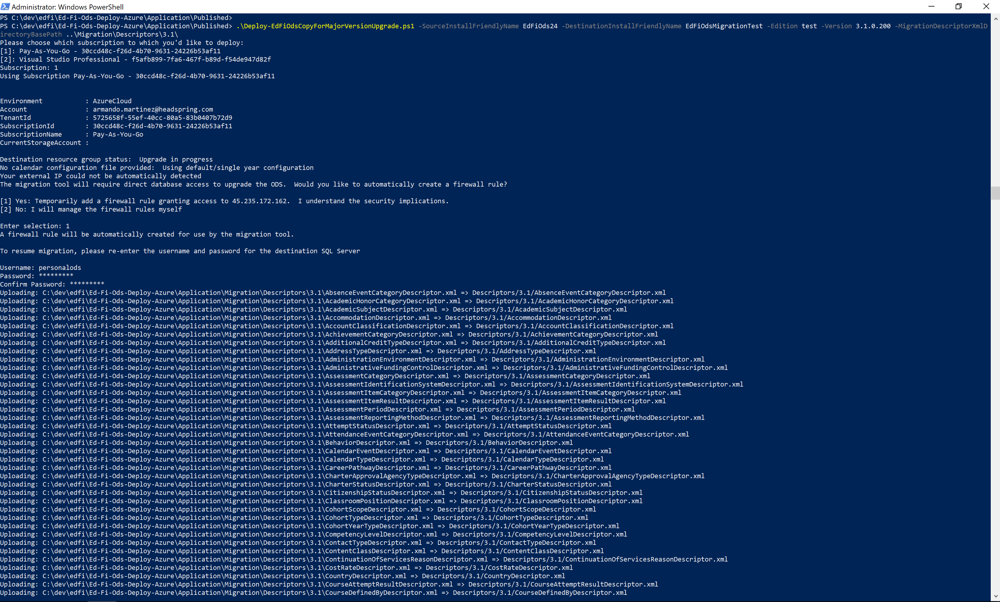

# Upgrade Cloud ODS using existing data

Prepares a new resource group for a major version upgrade using data from an
existing Ed-Fi ODS instance.

## Audience

This document is targeted at IT professionals with some experience in software
deployments. A minimal amount of experience with command prompts is necessary.
Some familiarity with Microsoft PowerShell is ideal. The user should also be
familiar with the Microsoft Azure portal and tools.

## Prerequisites

* Same prerequisites as in [Ed-Fi Cloud ODS Deploy Tools
  (Azure)](https://github.com/Ed-Fi-Alliance/Ed-Fi-Ods-Deploy-Azure).
* Review the [Migration
  Utility](https://techdocs.ed-fi.org/display/ODSAPI34/Migration+Utility)
  documentation.
* Review the [How To: Upgrade an ODS Database from version 2.x to version
  3.x](https://techdocs.ed-fi.org/display/ODSAPI34/How+To%3A+Upgrade+an+ODS+Database+from+Version+2.x+to+Version+3.4)
  documentation.

## Preparation

* Backup your current deployed databases.
* Use a folder for containing the migration process resources. You can create
  \Tools\Migration\ folder where you have saved your templates and scripts
  (C:\CloudOdsInstall).

    ```powershell
    cd C:\CloudOdsInstall\Tools\Migration
    ```

* Install Migration utility

   ```powershell
   dotnet tool install EdFi.Ods.Utilities.Migration --tool-path C:\CloudOdsInstall\Tools\Migration
   ```

* Create a Calendar Configuration file if required

## Upgraded deploy with data migration script parameters

The script .\Deploy-EdFiOdsCopyForMajorVersionUpgrade.ps1 has the following
parameters. Some parameters are used specifically for deploying the new Ed-Fi
ODS install. Other parameters are required for the migration process.

### Deploy Ed-Fi ODS parameters

* Source install friendly name

    Install-friendly name or Resource group name of the old Ed-Fi ODS instance
    containing data that will be migrated: e.g. 'EdFi ODS'.  This instance must
    already exist.

    ```powershell
    -SourceInstallFriendlyName "Your current Ed-Fi ODS Install Friendly Name"
    ```

* Destination install friendly name

    Install-friendly name or Resource group name of the new Ed-Fi ODS instance
    that will be created: e.g. 'EdFi ODS v3'.

    ```powershell
    -DestinationInstallFriendlyName "Friendly Name for the new Upgraded Ed-Fi ODS"
    ```

* Edition

    Edition of the new Ed-Fi ODS you want to deploy. The release edition will be
    chosen by default.

    ```powershell
    -Edition "release or test Edition for the new Ed-Fi ODS install"
    ```

* Version

    Version of the new Ed-Fi ODS you want to deploy.  The latest available
    version will be chosen by default.

    ```powershell
    -Version "Ed-Fi ODS new version install"
    ```

* Template file directory

    Points the script to the directory that holds the Ed-Fi ODS install
    templates. By default that directory is the same as the one that contains
    this script.

    ```powershell
    -TemplateFileDirectory "Your Path To\Migration\Templates\"
    ```

### Migration Utility parameters

* Migration Utility tool exe path

    Points the script to the EdFi ODS Migration console utility (.exe). By
    default, this utility is assumed to be installed in ..\Tools\Migration\

    ```powershell
    -MigrationToolExePath "Your Path To\Migration\Tool\"
    ```

* Descriptor namespace prefix

    Needed for major version upgrade only if there are non-default descriptors
    present.  Namespace prefix for new descriptors that are not in the Ed-Fi
    defaults.  Must be in the format: "uri://[organization_name]".

    ```powershell
    -DescriptorNamespacePrefix "uri://[organization_name]"
    ```

* Credential namespace prefix

    Needed to upgrade to v3.1 if there are records in the table edfi.Credential.
    Namespace prefix to use for all staff credential records.  Must be in the
    format: "uri://[organization_name]".

    ```powershell
    -CredentialNamespacePrefix "uri://[organization_name]"
    ```

* Calendar configuration

    Needed to upgrade to v3.1 if the source ODS has a calendar with multiple
    school years.  See migration utility documentation for details.

    ```powershell
    -CalendarConfigFilePath "Your Path To\Migration\CalendarConfig.csv"
    ```

* Migration script timeout

    Timeout (in seconds) to be applied to each transaction during the upgrade
    process.  Increase this value if you encounter timeout exceptions on larger
    datasets

    ```powershell
    -MigrationScriptTimeout "Timeout in seconds"
    ```

## Deploy an upgraded Ed-Fi ODS instance with database migration

1. Open a Powershell window and navigate to the directory containing the Cloud
   ODS scripts

```powershell
cd C:\CloudOdsInstall
```

2. Deploy an upgraded Cloud ODS:  run
   .\Deploy-EdFiOdsCopyForMajorVersionUpgrade.ps1 with all parameters your
   upgrade and data migration requires

    ```powershell
    $arguments = @{
        SourceInstallFriendlyName = "Your current Ed-Fi ODS Install Friendly Name"
        DestinationInstallFriendlyName = "Friendly Name for the new Upgraded Ed-Fi ODS"
        Edition = "release or test Edition for the new Ed-Fi ODS install"
        Version = "Version for the new Ed-Fi ODS install"
    }
    .\Deploy-EdFiOdsCopyForMajorVersionUpgrade.ps1 @arguments
    ```

    Add any parameter from previous section that best matches your upgrading install
    expectations and database migration process.

3. Deployment requires you to access to the Azure account that holds the current
   Ed-Fi ODS instance.

    

4. Enter your Azure credentials.

5. Choose the subscription where the instance should be deployed.

6. The migration tool will require direct database access to upgrade your ODS.
   You can choose either the script creates the firewall rule to allow your IP
   address access the database or do it yourself manually.

7. Choose an Azure datacenter region you want to deploy. You should try and use
   a region near you for optimal performance.

8. Enter the username and password for the destination SQL Server.

9. Wait for the deployment to process to complete.  You should see a new
   resource group in the Azure portal named as the value passed to parameter
   DestinationInstallFriendlyName.

   *Note: this extra instance is now accruing charges in your Azure account*

10. Continue with the database migration process by starting from step 2 using
    the same parameters you used the first time.

*Note: the deployment process will not execute again.*

11. From now on, if any error has been presented it will be reported. You can go
    an make the required changes to resources and parameter values, then resume
    the database migration process by starting from step 2.

*Note: the database migration process will resume from the last succeded step.
Re-enter the SQL credentials used in step 8 when requested.*



12. In the Azure portal, add a firewall rule for your current IP address to the
    Azure SQL server.

_Back to the [User's Guide Table of Contents](user-guide-toc.md)_
