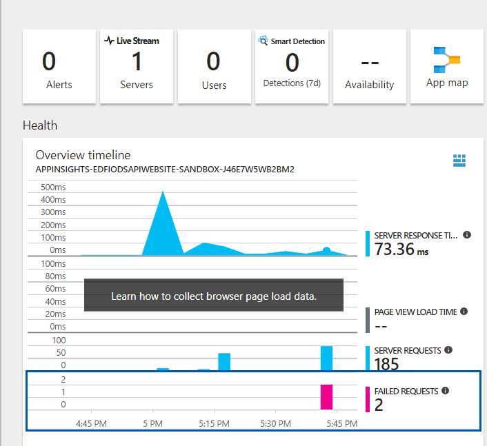
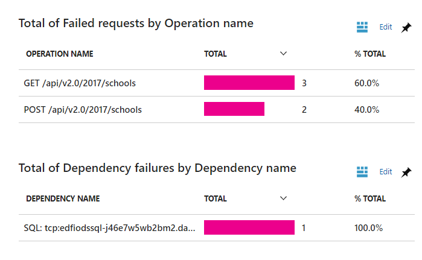
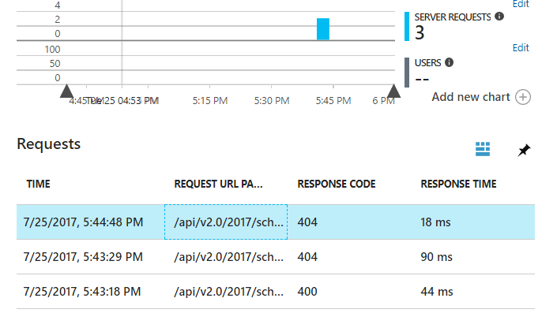
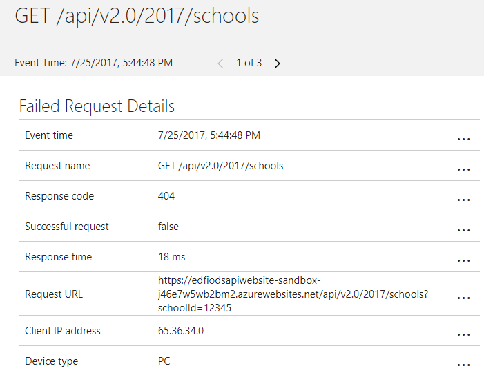

# Using Application Insights to Diagnose Problems

## About

Logs for the Cloud ODS are captured in Azure's Application Insights service.  If
data from other systems to the ODS is not syncing correctly, or you run into
other problems, you will want to inspect the logs for error information.  The
instructions below apply to both errors on the Cloud ODS APIs as well as those
within the Admin App.

Note also that Application Insights can be used for much more than viewing error
information. It can be helpful in understanding system usage and in system
tuning.

The easiest access point for these log entries is via the Azure Portal, by
drilling into the appropriate Application Insights resource. Entries are
captured as TRACE data, and can be filtered and searched.

## Getting Started

*Note that Application Insights (as with other Azure tools) is constantly
evolving. We recommend you consult the Microsoft documentation directly if more
information is needed.*

Login to the Azure Portal and locate the Resource Group containing your Cloud
ODS and API.

Then, choose the correct Application Insights resource.  In most cases, the log
data from the API server is what you'll want to retrieve, but data from the
Admin App is also logged as well.

Once in the AppInsights resource, the default view will display a variety of
summary information, including an error summary (at bottom of pane).

In this example, you can see there are 2 errors. Please note that you may need
to adjust the Time Range setting to see errors that occurred farther in the
past. You can click on these errors to get more information on the URL request
that failed (note the screenshot below occurs part-way down the page; you may
need to scroll to see it).

In this case, the errors were on the /schools URL and there were both GET and
POST operation errors.

Once again you can click on these bars beside a URL/HTTP operation combo to get
more information:

In this case, I can see that there were 3 errors on this URL within this time
period, two HTTP 404 errors and one 400 error.

If you click on the row for an error you will see more detail:

In this case, the 404 error was due to a incorrect schoolId parameter: the
schoolId '12345' submitted does not correspond to any school, so the system
correctly returned a 404 error.

Full stack traces and other diagnostic information can be looked up using these
techniques. For full information, we recommend you consult the Microsoft
Application Insights documentation.

_Back to the [User's Guide Table of Contents](user-guide-toc.md)_
