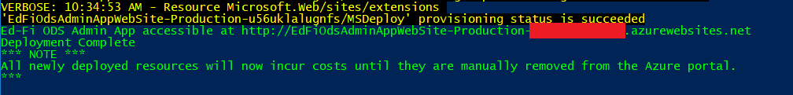
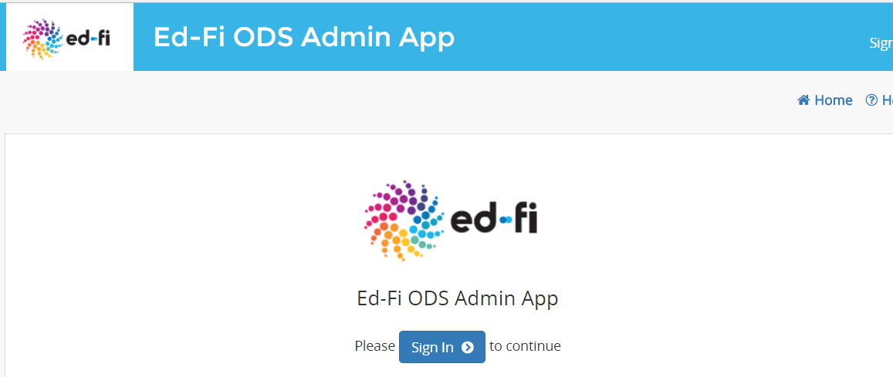
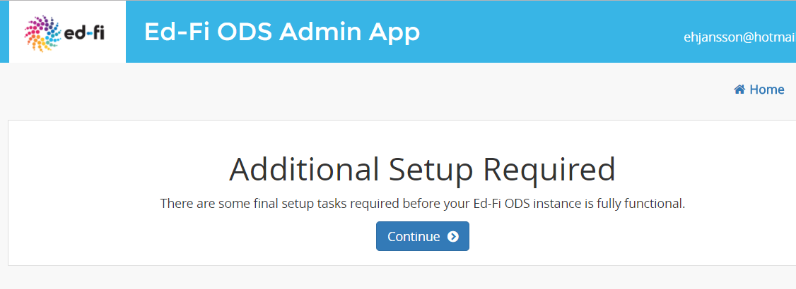

# Install Guide

_Also see [User's Guide](user-guide-toc.md)_

## Target Audience

This document is targeted at IT professionals with some experience in software
deployments. A minimal amount of experience with command prompts is necessary.
Some familiarity with Microsoft PowerShell is ideal. The user should also be
familiar with the Microsoft Azure portal and tools.

## Prerequisites

The following are prerequisites to run a successful ODS deployment using the ODS
ARM templates:

* An Azure account for your organization.
* The **[Global
  Administrator](https://azure.microsoft.com/en-us/documentation/articles/active-directory-assign-admin-roles/#details-about-the-global-administrator-role)**
  login for your Azure account OR an account that is in the Co-Owner role.
  Co-Admin accounts do not have sufficient privileges to run the installation
  script by default.
* Windows 7 or greater. (The installation script has not been tested on
  non-Windows versions of PowerShell.)
* PowerShell 3.0 or greater. Version 5 is recommended. Download at
  [https://www.microsoft.com/en-us/download/details.aspx?id=50395](https://www.microsoft.com/en-us/download/details.aspx?id=50395).
* Azure PowerShell cmdlets. You can do that using this command:

```powershell
Install-Module -Name AzureRM -RequiredVersion 4.3.1
```

* You can get more information on PowerShell Azure cmdlets here:
  [https://docs.microsoft.com/en-us/powershell/azure/install-azurerm-ps](https://docs.microsoft.com/en-us/powershell/azure/install-azurerm-ps?view=azurermps-4.1.0)
* The scripts have been tested to work with Azure cmdlets version 4.3.1; the
  scripts *do not* with Azure cmdlets version 5.x as breaking changes have been
  introduced by Microsoft.
* Note that you **_may_** need to launch PowerShell as an administrator
  (right-click and select "Run as Administrator") or change the execution
  policies (see instructions from Microsoft
  [here](https://msdn.microsoft.com/powershell/reference/5.1/microsoft.powershell.core/about/about_execution_policies))
  to install these tools.

## What is Deployed

With all the prerequisites satisfied you're almost ready to begin deploying the
ODS. Before you do, we recommend examining the resources that will be created
for you. There are quite a few pieces that compose the ODS and your organization
will be billed by Microsoft for these resources.

| Component| Type | Default Service Level | Approximate cost per month*
|--|--|--|--|
| Admin App | Azure Web App | S1 | $74 |
| ODS API | Azure Web App | S3** | $298** |
| Swagger Documentation | Azure Web App | (optional) | N/A |
| Administrative Database | Azure SQL Database | S2 | $75 |
| Security Database | Azure SQL Database | S2 | $75 |
| ODS Database | Azure SQL Database | P1** | $465** |
| Minimal Template Database | Azure SQL Database | S1 | $30 |
| Populated Template Database | Azure SQL Database | S1 | $30 |

_*Microsoft bills for Azure resources per hour and therefore costs vary month to
month. Pricing is also subject to change. See
[https://azure.microsoft.com/en-us/pricing/](https://azure.microsoft.com/en-us/pricing/)
for the most up-to-date pricing._  
_**The deployment script will deploy production assets at a lower performance
tier than listed above; once the production environment is fully configured, the
above performance tiers will be used._

## Deploying to Azure

With your Azure account established, Azure PowerShell module installed and
templates downloaded, you're ready to run a deployment of the ODS.

1. Determine the Azure region where you want to provision your Cloud ODS
   resources. 

   The full list can be found
   [here](https://azure.microsoft.com/en-us/regions/). It is recommended you
   choose a region close to your organization for best performance. Or, if you
   already have assets in Azure, choose the region where your pre-existing
   assets are located. For example, organizations in North Carolina would choose
   the "East US" region. Organizations in Oregon would select the "West US"
   region.

2. (Optional) Determine what version of the Cloud ODS you want to install. 

   If you want to install a specific version of the Cloud ODS, provide that
   version number to the setup script via the _-Setup_ parameter; otherwise, the
   script will install the latest version available by default.

3. (Optional) Choose a "friendly name" to identify this ODS. 

   By default this will be "EdFi ODS" and will help you identify resources
   associated with this particular installation of the Cloud ODS when viewing
   your Azure account. You'll also need to know this name when applying updates
   to your Cloud ODS. (The friendly name will be used as the resource group name
   in Azure and for the Azure Active Directory app registration).

4. (Optional) Determine if you want a test installation with sample data and
   swagger documentation.

   You can opt for these during setup. By default, swagger documentation will
   not be deployed and sample data will not be provisioned.  

5. Start a new PowerShell session.

6. Navigate to the directory where you've saved your templates and scripts (ex.
   C:\CloudOdsInstall\)

```powershell
cd C:\CloudOdsInstall\
```

7. Run the Deploy-EdFiOds.ps1 script.

   If this is the first time you're running PowerShell, you'll need to adjust
   the script execution policy on your machine to 'Unrestricted'. See
   [here](https://msdn.microsoft.com/powershell/reference/5.1/microsoft.powershell.core/about/about_execution_policies)
   for more info.

   A common installation command might look like this:

```powershell
.\Deploy-EdFiOds.ps1 -ResourceGroupLocation "South Central US" -InstallFriendlyName "My ODS"
```

As the deployment begins, you will be prompted for a few more pieces of
information.

First, your Azure account credentials.


* **Note that the user credentials provided here MUST for be an Azure account
  administrator.** This is necessary because the installation creates billable
  resources.
* Note also that the credentials are being provided to Microsoft via a Microsoft
  login form, and are not saved or help anywhere.


Next, if your login has access to multiple subscriptions you'll be prompted to
choose the subscription in which the Cloud ODS should be installed.


Finally, you'll be asked for a username and password for SQL Server. The
deployment process will create a new SQL Server resource in Azure, and the
administrative user will be created with these credentials.

* Be sure to choose a strong password and store these credentials in a secure
  location for later access.
* Note also that the chosen password will be required to meet complexity
  requirements described at
  [https://msdn.microsoft.com/en-us/library/ms161959.aspx?f=255&MSPPError=-2147217396](https://msdn.microsoft.com/en-us/library/ms161959.aspx?f=255&MSPPError=-2147217396)


This part of the setup and deployment can take a while to run sometimes 20
minutes or longer. During this time you'll see logging info from Azure scroll
by. This is expected behavior.


Once the deploy completes, you should see a success message that includes the
URL for the Admin App. You will need this URL to complete the set process (see
below).



## Next Steps

With the deployment complete, you're ready to login to the Cloud ODS Admin App
for the first time. You should find the URL to the app at the end of the output
in the PowerShell window where you ran the install script.

  

__Login Note:__
> Remember - the Cloud ODS Admin App is tied to your Azure Active Directory
> login. If any users in your organization (other than yourself) need access to
> the Admin App, you'll need to grant them access in Azure Active Directory (see
> [here](https://docs.microsoft.com/en-us/azure/active-directory/active-directory-coreapps-assign-user-azure-portal)
> for details).

Point your Web browser to the URL and you'll be greeted with the login screen
for your Cloud ODS Admin App. After logging in for the first time, you'll see a
screen prompting to **Sign In** (if you are not already signed in in your
browser)



Following sign in, you will be asked to complete the setup process. Click on
**Continue** to complete the setup.

Please note that this last steps performs tasks such as configuring the
Application access to the new SQL Server, and so requires all Azure platform
resources to be configured and available. As a result, this last step may take a
few minutes, and sometimes up to a half hour to allow Azure to complete its
platform setup operations.



Following the setup, you will see the Cloud ODS home screen and your Cloud ODS
is ready for usage.

We recommend you consult the [Cloud ODS and API User
Guide](documentation/readme.md) for more information on the Admin App and Cloud
ODS features.

__Note for Systems Administrators__
> Now that the ODS has been provisioned into your Azure account, all
> non-ODS-specific administration tasks (e.g. backups, system scaling, etc.) are
> managed via the Azure portal. The provisioned resources are all Platform as a
> Service, meaning Azure manages most maintenance tasks for you.

## Other Installation Options

There are other, advanced options available in the install script. You can view
more information about these options by running the following PowerShell command

```powershell
Get-Help .\Deploy-EdFiOds.ps1 -Detailed
```

One advanced option allows you to run the Cloud ODS against a SQL Server of your
own choosing. The `-UseMyOwnSqlServer` install script parameter will prevent the
script from deploying an Azure SQL instance on your behalf and instead prompt
for connection information. This is a good option if your organization prefers
more direct control of your SQL Server or if you have a pre-existing server you
want to reuse.

See [Using an Existing On-Premise SQL
Server](documentation/UseExistingOnPremiseSqlServer.md) for detailed information
on the SQL Server configurations that must be manually applied if you choose to
use your own SQL Server.